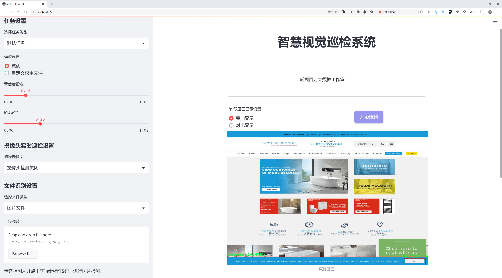
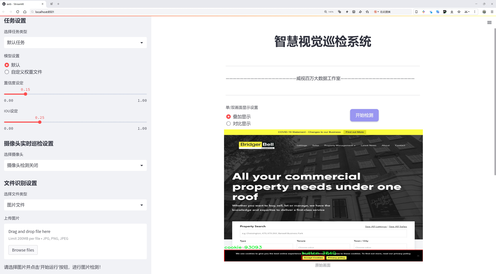

# 网站按钮检测检测系统源码分享
 # [一条龙教学YOLOV8标注好的数据集一键训练_70+全套改进创新点发刊_Web前端展示]

### 1.研究背景与意义

项目参考[AAAI Association for the Advancement of Artificial Intelligence](https://gitee.com/qunshansj/projects)

项目来源[AACV Association for the Advancement of Computer Vision](https://gitee.com/qunmasj/projects)

研究背景与意义

随着互联网的快速发展，网站的用户体验日益成为影响用户留存和转化率的重要因素。在这一背景下，网站界面设计中的按钮元素，作为用户与网站交互的关键组成部分，其识别与优化显得尤为重要。传统的按钮检测方法往往依赖于人工标注和规则定义，效率低下且难以适应多样化的设计风格。近年来，深度学习技术的迅猛发展为这一问题提供了新的解决方案。尤其是YOLO（You Only Look Once）系列模型，以其高效的实时目标检测能力，成为了计算机视觉领域的重要工具。

本研究旨在基于改进的YOLOv8模型，构建一个高效的网站按钮检测系统。通过对现有YOLOv8模型的优化，我们希望能够提高按钮检测的准确性和速度，从而为网站设计师和开发者提供更为便捷的工具，帮助他们在设计过程中快速识别和优化按钮元素。为了实现这一目标，我们使用了一个包含2200张图像的数据集，该数据集由两类对象组成：按钮和饼干（cookie）。尽管饼干并非直接与按钮相关的元素，但其存在为模型的训练提供了多样性，有助于提升模型在复杂场景下的鲁棒性。

按钮作为用户界面的重要组成部分，其设计与布局直接影响用户的操作效率和满意度。因此，准确检测和分析按钮的分布、样式和功能，对于提升网站的可用性具有重要意义。通过自动化的按钮检测系统，设计师可以快速获取网站中按钮的相关信息，进而进行针对性的优化。此外，改进YOLOv8模型的应用，不仅可以提升检测精度，还能实现实时反馈，为用户提供更为流畅的交互体验。

在技术层面，YOLOv8模型相较于其前身在速度和精度上都有显著提升，尤其在小目标检测方面表现优异。通过对模型的改进，我们可以更好地适应不同分辨率和设计风格的网站界面，提高检测的准确性。同时，利用数据增强和迁移学习等技术，可以进一步提升模型的泛化能力，使其在不同网站场景下均能保持良好的性能。

综上所述，本研究不仅具有重要的理论意义，也具备广泛的应用前景。通过构建基于改进YOLOv8的网站按钮检测系统，我们期望能够推动网站设计领域的自动化进程，提升用户体验，并为后续相关研究提供有价值的参考和借鉴。随着技术的不断进步，未来的按钮检测系统将不仅限于静态图像分析，还可以扩展到动态交互场景中，为用户提供更为智能化的服务。

### 2.图片演示






##### 注意：由于此博客编辑较早，上面“2.图片演示”和“3.视频演示”展示的系统图片或者视频可能为老版本，新版本在老版本的基础上升级如下：（实际效果以升级的新版本为准）

  （1）适配了YOLOV8的“目标检测”模型和“实例分割”模型，通过加载相应的权重（.pt）文件即可自适应加载模型。

  （2）支持“图片识别”、“视频识别”、“摄像头实时识别”三种识别模式。

  （3）支持“图片识别”、“视频识别”、“摄像头实时识别”三种识别结果保存导出，解决手动导出（容易卡顿出现爆内存）存在的问题，识别完自动保存结果并导出到tempDir中。

  （4）支持Web前端系统中的标题、背景图等自定义修改，后面提供修改教程。

  另外本项目提供训练的数据集和训练教程,暂不提供权重文件（best.pt）,需要您按照教程进行训练后实现图片演示和Web前端界面演示的效果。

### 3.视频演示

[3.1 视频演示](https://www.bilibili.com/video/BV19n4femEND/)

### 4.数据集信息展示

##### 4.1 本项目数据集详细数据（类别数＆类别名）

nc: 2
names: ['button', 'cookie']


##### 4.2 本项目数据集信息介绍

数据集信息展示

在本研究中，我们使用了名为“cookieravenous”的数据集，以支持改进YOLOv8的网站按钮检测系统的训练与测试。该数据集专注于两个主要类别，分别是“button”（按钮）和“cookie”（饼干），为我们的模型提供了丰富的样本和多样化的场景。这种分类的选择不仅体现了我们对网站用户交互元素的关注，也为我们在视觉识别领域的研究提供了独特的视角。

“cookieravenous”数据集包含了大量与按钮和饼干相关的图像，旨在模拟真实网站环境中的各种情况。数据集中的“button”类别涵盖了不同样式、颜色和形状的按钮，这些按钮可能出现在各种网页设计中，如电子商务网站、社交媒体平台和信息门户等。通过对这些按钮的检测，系统能够识别用户界面中的交互元素，从而提高用户体验和操作效率。

另一方面，“cookie”类别则包含了多种类型的饼干图像，这些饼干不仅在外观上各具特色，而且在背景和光照条件上也存在显著差异。这种多样性使得模型在训练过程中能够学习到更为复杂的特征，从而在实际应用中具备更强的泛化能力。饼干的引入不仅增加了数据集的趣味性，也为模型提供了更多的挑战，尤其是在处理复杂背景和不同拍摄角度时。

数据集的构建过程中，图像的标注和分类是至关重要的。每一张图像都经过精确的标注，以确保模型在训练时能够准确识别和区分这两个类别。通过高质量的标注，我们能够有效地提高模型的准确性和可靠性。此外，数据集还包含了多种场景和环境设置，使得模型能够在不同的实际应用中表现出色。

在使用“cookieravenous”数据集进行YOLOv8模型的训练时，我们特别关注了模型的精度和召回率。通过不断优化模型参数和调整训练策略，我们希望能够实现更高的检测准确率，以满足实际应用的需求。随着训练的深入，模型将逐渐掌握按钮和饼干的特征，从而在实时检测中表现出色。

总之，“cookieravenous”数据集为我们改进YOLOv8的网站按钮检测系统提供了坚实的基础。通过对按钮和饼干这两个类别的深入研究，我们不仅能够提升模型的性能，还能为未来的研究和应用奠定基础。随着技术的不断进步，我们期待这一数据集能够为更多的视觉识别任务提供支持，推动相关领域的发展。


### 5.全套项目环境部署视频教程（零基础手把手教学）

[5.1 环境部署教程链接（零基础手把手教学）](https://www.ixigua.com/7404473917358506534?logTag=c807d0cbc21c0ef59de5)


[5.2 安装Python虚拟环境创建和依赖库安装视频教程链接（零基础手把手教学）](https://www.ixigua.com/7404474678003106304?logTag=1f1041108cd1f708b01a)

### 6.手把手YOLOV8训练视频教程（零基础小白有手就能学会）

[6.1 手把手YOLOV8训练视频教程（零基础小白有手就能学会）](https://www.ixigua.com/7404477157818401292?logTag=d31a2dfd1983c9668658)

### 7.70+种全套YOLOV8创新点代码加载调参视频教程（一键加载写好的改进模型的配置文件）

[7.1 70+种全套YOLOV8创新点代码加载调参视频教程（一键加载写好的改进模型的配置文件）](https://www.ixigua.com/7404478314661806627?logTag=29066f8288e3f4eea3a4)

### 8.70+种全套YOLOV8创新点原理讲解（非科班也可以轻松写刊发刊，V10版本正在科研待更新）

由于篇幅限制，每个创新点的具体原理讲解就不一一展开，具体见下列网址中的创新点对应子项目的技术原理博客网址【Blog】：


[8.1 70+种全套YOLOV8创新点原理讲解链接](https://gitee.com/qunmasj/good)

### 9.系统功能展示（检测对象为举例，实际内容以本项目数据集为准）

图9.1.系统支持检测结果表格显示

  图9.2.系统支持置信度和IOU阈值手动调节

  图9.3.系统支持自定义加载权重文件best.pt(需要你通过步骤5中训练获得)

  图9.4.系统支持摄像头实时识别

  图9.5.系统支持图片识别

  图9.6.系统支持视频识别

  图9.7.系统支持识别结果文件自动保存

  图9.8.系统支持Excel导出检测结果数据


### 10.原始YOLOV8算法原理

原始YOLOv8算法原理

YOLOv8（You Only Look Once version 8）是目标检测领域的一项重要进展，由Ultralytics团队在YOLOv5的基础上进行改进，结合了近两年内多项经过实际验证的技术创新。该模型在2023年1月正式提出，旨在提升目标检测的精度和速度，适应更为复杂的应用场景。YOLOv8的设计理念延续了YOLO系列模型的优良传统，即在保证实时性的同时，提升检测的准确性和鲁棒性。

YOLOv8的网络结构由多个核心组件构成，包括输入层、主干网络、颈部网络和头部网络。输入层负责对图像进行预处理，将其缩放至指定的输入尺寸，以满足后续网络处理的需求。主干网络是YOLOv8的特征提取核心，采用卷积操作对输入图像进行下采样，以提取多层次的特征信息。与之前的YOLO版本相比，YOLOv8在主干网络中引入了C2f模块，取代了传统的C3模块。C2f模块借鉴了YOLOv7中的E-ELAN结构，通过引入更多的跳层连接，增强了模型的梯度流动性，使得特征提取更加高效。这种设计不仅提升了模型的学习能力，还在一定程度上实现了模型的轻量化，确保了在移动设备上的应用可行性。

在主干网络的末尾，YOLOv8保留了SPPF（Spatial Pyramid Pooling Fast）模块，该模块通过三个最大池化层处理多尺度特征，进一步增强了网络的特征抽象能力。SPPF模块的引入，使得YOLOv8能够更好地处理不同尺寸的目标，提升了模型在复杂场景下的表现。

颈部网络是YOLOv8的重要组成部分，负责融合来自主干网络的不同尺度特征图信息。YOLOv8采用了FPNS（Feature Pyramid Network）和PAN（Path Aggregation Network）结构，这两种结构的结合使得模型能够有效地整合多层次的特征信息，从而提高检测的精度和稳定性。通过这种特征融合机制，YOLOv8能够在处理小目标和大目标时，保持较高的检测性能。

在头部网络中，YOLOv8采用了解耦的检测头设计，这一设计理念源自于YOLOX模型。具体而言，YOLOv8的头部网络由两个并行的卷积分支组成，分别用于计算目标的类别和位置特征。这种分支结构的设计，使得分类任务和定位任务可以独立优化，分别关注特征图中提取到的特征与已有类别的相似性，以及边界框与真实框之间的位置关系。通过这种方式，YOLOv8在收敛速度和预测精度上都有了显著提升。

值得一提的是，YOLOv8在检测过程中采用了无锚框结构，直接预测目标的中心位置，并引入了任务对齐学习（Task Alignment Learning，TAL）机制。这一机制通过引入分类分数和IOU（Intersection over Union）的高次幂乘积，作为衡量任务对齐程度的指标，进一步优化了模型的分类和定位性能。通过这种创新，YOLOv8在同时提升定位和分类的准确性方面，表现出了优越的能力。

在训练过程中，YOLOv8对数据增强策略进行了优化。虽然Mosaic数据增强在提升模型鲁棒性和泛化性方面有一定效果，但YOLOv8在训练的最后10个epoch中停止使用该策略，以避免破坏数据的真实分布。这一调整使得模型在学习过程中更加专注于真实数据的特征，从而提升了最终的检测效果。

通过一系列的结构优化和创新设计，YOLOv8在多个目标检测基准上表现出色。尤其是在COCO数据集上，YOLOv8在相同模型尺寸下，取得了比其他YOLO系列模型更高的精度和更快的推理速度。具体而言，YOLOv8在检测精度（mAP50-95）和推理延迟方面的表现，均优于之前的版本，显示出其在实际应用中的巨大潜力。

综上所述，YOLOv8不仅在结构上进行了多项创新，还在训练策略和数据处理上进行了优化，旨在为目标检测任务提供更为高效和准确的解决方案。其轻量化设计和高效的特征提取能力，使得YOLOv8在移动平台和实时应用中具备了广泛的应用前景。随着研究的深入，YOLOv8无疑将在目标检测领域继续发挥重要作用，推动相关技术的进一步发展。


### 11.项目核心源码讲解（再也不用担心看不懂代码逻辑）

#### 11.1 70+种YOLOv8算法改进源码大全和调试加载训练教程（非必要）\ultralytics\models\sam\modules\decoders.py


这个文件定义了一个名为 `MaskDecoder` 的类，主要用于生成图像的掩码以及相关的质量评分。它使用了变换器（Transformer）架构来根据图像和提示嵌入（prompt embeddings）预测掩码。文件中还定义了一个辅助类 `MLP`，用于构建多层感知器（Multi-Layer Perceptron）模型。

在 `MaskDecoder` 类的构造函数中，初始化了一些重要的属性，包括变换器的维度、变换器模块本身、要预测的掩码数量、IoU（Intersection over Union）标记的嵌入、掩码标记的嵌入、输出上采样的神经网络序列以及用于生成掩码的超网络多层感知器（MLPs）。此外，还有一个用于预测掩码质量的MLP。

`forward` 方法是模型的前向传播函数，接收图像嵌入、图像的位置信息、稀疏提示嵌入、密集提示嵌入以及一个布尔值（指示是否返回多个掩码）。它调用 `predict_masks` 方法来生成掩码和IoU预测，然后根据 `multimask_output` 的值选择输出的掩码和IoU预测。

`predict_masks` 方法负责具体的掩码预测过程。它首先将IoU标记和掩码标记的权重进行拼接，并与稀疏提示嵌入一起形成输入标记。接着，它扩展图像嵌入以适应每个掩码的预测，并将其与密集提示嵌入相加。然后，使用变换器处理这些数据，得到IoU标记和掩码标记的输出。最后，通过上采样和超网络MLPs生成最终的掩码，并预测IoU质量。

`MLP` 类是一个简单的多层感知器实现，包含多个线性层和ReLU激活函数。构造函数中定义了输入维度、隐藏层维度、输出维度和层数。`forward` 方法执行前向传播，并在最后一层应用sigmoid激活（如果需要）。

整体来看，这个文件实现了一个复杂的掩码解码器，结合了深度学习中的变换器和多层感知器，能够有效地处理图像掩码的生成和质量评估。

#### 11.1 code\log.py

以下是经过简化和注释的核心代码部分：

```python
import os
import time
import cv2
import pandas as pd
from PIL import Image

def save_chinese_image(file_path, image_array):
    """
    保存带有中文路径的图片文件

    参数：
    file_path (str): 图片的保存路径，应包含中文字符
    image_array (numpy.ndarray): 要保存的 OpenCV 图像（即 numpy 数组）
    """
    try:
        # 将 OpenCV 图片转换为 Pillow Image 对象
        image = Image.fromarray(cv2.cvtColor(image_array, cv2.COLOR_BGR2RGB))
        # 使用 Pillow 保存图片文件
        image.save(file_path)
        print(f"成功保存图像到: {file_path}")
    except Exception as e:
        print(f"保存图像失败: {str(e)}")

class LogTable:
    def __init__(self, csv_file_path=None):
        """
        初始化LogTable类实例。

        参数：
        csv_file_path (str): 保存初始数据的CSV文件路径。
        """
        self.csv_file_path = csv_file_path
        # 初始化保存图像和结果的列表
        self.saved_images = []
        self.saved_results = []

        # 尝试从CSV文件加载数据，如果失败则创建一个空的DataFrame
        columns = ['文件路径', '识别结果', '位置', '面积', '时间']
        if not os.path.exists(csv_file_path):
            # 如果文件不存在，创建一个带有初始表头的空DataFrame并保存为CSV文件
            empty_df = pd.DataFrame(columns=columns)
            empty_df.to_csv(csv_file_path, index=False, header=True)
        self.data = pd.DataFrame(columns=columns)

    def add_log_entry(self, file_path, recognition_result, position, confidence, time_spent):
        """
        向日志中添加一条新记录。

        参数：
        file_path (str): 文件路径
        recognition_result (str): 识别结果
        position (str): 位置
        confidence (float): 置信度
        time_spent (float): 用时（通常是秒或毫秒）

        返回：
        None
        """
        # 创建新的数据行
        new_entry = pd.DataFrame([[file_path, recognition_result, position, confidence, time_spent]],
                                 columns=['文件路径', '识别结果', '位置', '面积', '时间'])
        # 将新行添加到DataFrame中
        self.data = pd.concat([new_entry, self.data]).reset_index(drop=True)

    def save_to_csv(self):
        """
        将更新后的DataFrame保存到CSV文件。
        """
        self.data.to_csv(self.csv_file_path, index=False, encoding='utf-8', mode='a', header=False)

    def clear_data(self):
        """
        清空当前数据。
        """
        columns = ['文件路径', '识别结果', '位置', '面积', '时间']
        self.data = pd.DataFrame(columns=columns)
```

### 代码说明：
1. **save_chinese_image**：该函数用于保存带有中文路径的图像。它将OpenCV格式的图像转换为Pillow格式，并保存到指定路径。

2. **LogTable类**：
   - **__init__**：初始化类实例，检查CSV文件是否存在，如果不存在则创建一个新的空DataFrame。
   - **add_log_entry**：向日志中添加一条新记录，记录文件路径、识别结果、位置、置信度和用时。
   - **save_to_csv**：将当前的DataFrame保存到CSV文件中。
   - **clear_data**：清空当前的数据，重置DataFrame。 

以上是核心代码部分及其详细注释，便于理解其功能和用途。

这个程序文件`log.py`主要用于处理图像数据和记录检测结果。它使用了多个库，包括`os`、`time`、`cv2`（OpenCV）、`pandas`、`PIL`（Pillow）和`numpy`，并且涉及到图像的保存、结果的记录和数据的管理。

首先，程序定义了一个`save_chinese_image`函数，用于保存带有中文路径的图像文件。该函数接收两个参数：文件路径和图像数组。它尝试将OpenCV格式的图像转换为Pillow格式，然后保存到指定路径。如果保存失败，会捕获异常并输出错误信息。

接下来，定义了一个`ResultLogger`类，用于记录检测结果。该类在初始化时创建一个空的DataFrame，包含“识别结果”、“位置”、“面积”和“时间”四个列。`concat_results`方法用于将新的检测结果添加到DataFrame中，接收结果、位置、置信度和时间作为参数，并返回更新后的DataFrame。

然后是`LogTable`类，它用于管理图像和结果的记录。该类在初始化时尝试从指定的CSV文件加载数据，如果文件不存在，则创建一个新的空DataFrame。`add_frames`方法用于添加图像和检测信息，`clear_frames`方法用于清空已保存的图像和结果。`save_frames_file`方法根据保存的图像数量决定是保存为单张图片还是视频，并将其保存到指定路径。

此外，`add_log_entry`方法用于向日志中添加新记录，接收文件路径、识别结果、位置、置信度和用时作为参数，并将新记录添加到DataFrame中。`clear_data`方法用于清空DataFrame，`save_to_csv`方法将更新后的DataFrame保存到CSV文件中。

最后，`update_table`方法用于更新表格，显示最新的500条记录，适用于与Streamlit等框架结合使用，以便在用户界面上展示数据。

总体来说，这个程序文件提供了一套完整的功能，用于图像的处理、结果的记录和数据的管理，适合用于需要记录和分析图像检测结果的应用场景。

#### 11.2 ui.py

```python
import sys
import subprocess

def run_script(script_path):
    """
    使用当前 Python 环境运行指定的脚本。

    Args:
        script_path (str): 要运行的脚本路径

    Returns:
        None
    """
    # 获取当前 Python 解释器的路径
    python_path = sys.executable

    # 构建运行命令
    command = f'"{python_path}" -m streamlit run "{script_path}"'

    # 执行命令
    result = subprocess.run(command, shell=True)
    if result.returncode != 0:
        print("脚本运行出错。")


# 实例化并运行应用
if __name__ == "__main__":
    # 指定您的脚本路径
    script_path = "web.py"  # 这里可以直接指定脚本名称

    # 运行脚本
    run_script(script_path)
```

### 代码核心部分及注释

1. **导入必要的模块**：
   - `sys`：用于访问与 Python 解释器相关的变量和函数。
   - `subprocess`：用于执行外部命令和程序。

2. **定义 `run_script` 函数**：
   - 该函数接收一个脚本路径作为参数，并在当前 Python 环境中运行该脚本。

3. **获取当前 Python 解释器的路径**：
   - `python_path = sys.executable`：获取当前正在使用的 Python 解释器的完整路径。

4. **构建运行命令**：
   - `command = f'"{python_path}" -m streamlit run "{script_path}"'`：构建一个命令字符串，用于运行指定的脚本。这里使用了 `streamlit` 模块来运行 Python 脚本。

5. **执行命令**：
   - `result = subprocess.run(command, shell=True)`：使用 `subprocess.run` 方法执行构建的命令。`shell=True` 允许在 shell 中执行命令。

6. **检查命令执行结果**：
   - `if result.returncode != 0:`：检查命令的返回码，如果不为 0，表示执行过程中出现错误，打印错误信息。

7. **主程序入口**：
   - `if __name__ == "__main__":`：确保该代码块仅在直接运行该脚本时执行，而不是在被导入时执行。
   - `script_path = "web.py"`：指定要运行的脚本文件名。
   - `run_script(script_path)`：调用 `run_script` 函数，传入脚本路径以执行该脚本。

这个程序文件的主要功能是通过当前的 Python 环境来运行一个指定的脚本，具体来说是运行一个名为 `web.py` 的脚本。程序首先导入了必要的模块，包括 `sys`、`os` 和 `subprocess`，以及一个自定义的 `abs_path` 函数，这个函数可能用于获取脚本的绝对路径。

在 `run_script` 函数中，首先获取当前 Python 解释器的路径，这样可以确保使用正确的 Python 环境来执行脚本。接着，构建一个命令字符串，这个命令使用 `streamlit` 模块来运行指定的脚本。`streamlit` 是一个用于构建数据应用的库，因此这个程序可能是为了启动一个数据应用。

随后，使用 `subprocess.run` 方法来执行构建好的命令。这个方法会在一个新的进程中运行命令，并等待其完成。如果命令执行的返回码不为零，表示脚本运行出错，程序会打印出错误信息。

在文件的最后部分，使用 `if __name__ == "__main__":` 语句来确保只有在直接运行这个文件时才会执行下面的代码。在这里，指定了要运行的脚本路径为 `web.py`，并调用 `run_script` 函数来执行这个脚本。

总体来说，这个程序是一个简单的脚本启动器，能够在当前 Python 环境中运行一个指定的 Python 脚本，并处理可能出现的错误。

#### 11.3 code\ultralytics\utils\plotting.py

以下是代码中最核心的部分，并附上详细的中文注释：

```python
class Colors:
    """
    Ultralytics 默认颜色调色板，提供了处理颜色的方法，包括将十六进制颜色代码转换为 RGB 值。
    """

    def __init__(self):
        """初始化颜色调色板，使用 matplotlib 的默认颜色。"""
        hexs = (
            "FF3838", "FF9D97", "FF701F", "FFB21D", "CFD231",
            "48F90A", "92CC17", "3DDB86", "1A9334", "00D4BB",
            "2C99A8", "00C2FF", "344593", "6473FF", "0018EC",
            "8438FF", "520085", "CB38FF", "FF95C8", "FF37C7",
        )
        # 将十六进制颜色转换为 RGB 并存储在调色板中
        self.palette = [self.hex2rgb(f"#{c}") for c in hexs]
        self.n = len(self.palette)  # 调色板中颜色的数量
        # 定义特定的颜色调色板
        self.pose_palette = np.array(
            [
                [255, 128, 0], [255, 153, 51], [255, 178, 102],
                [230, 230, 0], [255, 153, 255], [153, 204, 255],
                [255, 102, 255], [255, 51, 255], [102, 178, 255],
                [51, 153, 255], [255, 153, 153], [255, 102, 102],
                [255, 51, 51], [153, 255, 153], [102, 255, 102],
                [51, 255, 51], [0, 255, 0], [0, 0, 255],
                [255, 0, 0], [255, 255, 255],
            ],
            dtype=np.uint8,
        )

    def __call__(self, i, bgr=False):
        """根据索引返回颜色，如果 bgr 为 True，则返回 BGR 格式的颜色。"""
        c = self.palette[int(i) % self.n]
        return (c[2], c[1], c[0]) if bgr else c

    @staticmethod
    def hex2rgb(h):
        """将十六进制颜色代码转换为 RGB 值（即 PIL 默认顺序）。"""
        return tuple(int(h[1 + i : 1 + i + 2], 16) for i in (0, 2, 4))


class Annotator:
    """
    Ultralytics 注释器，用于训练/验证马赛克和 JPG 图像的注释。
    """

    def __init__(self, im, line_width=None, font_size=None, font="Arial.ttf", pil=False, example="abc"):
        """初始化 Annotator 类，设置图像、线宽和颜色调色板。"""
        assert im.data.contiguous, "图像不连续。请对输入图像应用 np.ascontiguousarray(im)。"
        non_ascii = not is_ascii(example)  # 检查是否包含非 ASCII 字符
        self.pil = pil or non_ascii  # 根据是否使用 PIL 进行初始化
        self.lw = line_width or max(round(sum(im.shape) / 2 * 0.003), 2)  # 线宽
        if self.pil:  # 使用 PIL
            self.im = im if isinstance(im, Image.Image) else Image.fromarray(im)
            self.draw = ImageDraw.Draw(self.im)
            try:
                font = check_font("Arial.Unicode.ttf" if non_ascii else font)
                size = font_size or max(round(sum(self.im.size) / 2 * 0.035), 12)
                self.font = ImageFont.truetype(str(font), size)
            except Exception:
                self.font = ImageFont.load_default()
        else:  # 使用 cv2
            self.im = im if im.flags.writeable else im.copy()
            self.tf = max(self.lw - 1, 1)  # 字体厚度
            self.sf = self.lw / 3  # 字体缩放

    def box_label(self, box, label="", color=(128, 128, 128), txt_color=(255, 255, 255), rotated=False):
        """在图像上添加一个带标签的矩形框。"""
        if isinstance(box, torch.Tensor):
            box = box.tolist()
        if self.pil or not is_ascii(label):
            if rotated:
                self.draw.polygon([tuple(b) for b in box], width=self.lw, outline=color)  # 绘制多边形
            else:
                self.draw.rectangle(box, width=self.lw, outline=color)  # 绘制矩形
            if label:
                w, h = self.font.getsize(label)  # 获取文本宽度和高度
                self.draw.rectangle(
                    (box[0], box[1] - h, box[0] + w + 1, box[1] + 1),
                    fill=color,
                )
                self.draw.text((box[0], box[1] - h), label, fill=txt_color, font=self.font)
        else:  # cv2
            p1, p2 = (int(box[0]), int(box[1])), (int(box[2]), int(box[3]))
            cv2.rectangle(self.im, p1, p2, color, thickness=self.lw, lineType=cv2.LINE_AA)  # 绘制矩形
            if label:
                w, h = cv2.getTextSize(label, 0, fontScale=self.sf, thickness=self.tf)[0]  # 获取文本宽度和高度
                cv2.rectangle(self.im, p1, (p1[0] + w, p1[1] - h - 3), color, -1, cv2.LINE_AA)  # 填充背景
                cv2.putText(self.im, label, (p1[0], p1[1] - 2), 0, self.sf, txt_color, thickness=self.tf, lineType=cv2.LINE_AA)

    def result(self):
        """返回注释后的图像作为数组。"""
        return np.asarray(self.im)
```

以上代码包含了颜色处理和图像注释的核心功能。`Colors` 类用于处理颜色的转换，而 `Annotator` 类则用于在图像上绘制矩形框和标签。这些功能在计算机视觉任务中非常常见，尤其是在目标检测和图像标注的应用中。

这个程序文件是Ultralytics YOLO项目中的一个绘图工具模块，主要用于图像的可视化和标注。它包含多个类和函数，提供了丰富的功能来处理图像数据，绘制边界框、关键点、掩膜等，并且能够保存和展示结果。

首先，文件导入了一些必要的库，包括`cv2`、`matplotlib`、`numpy`、`torch`和`PIL`等，这些库为图像处理和绘图提供了支持。接着，定义了一个`Colors`类，用于管理颜色调色板，包括将十六进制颜色代码转换为RGB值的功能。这个类初始化了一组默认的颜色，用于后续的绘图操作。

接下来，定义了`Annotator`类，它是主要的图像标注工具。这个类的构造函数接受图像、线宽、字体等参数，并根据使用的绘图库（PIL或cv2）进行相应的初始化。`Annotator`类提供了多种方法来绘制边界框、关键点、文本和掩膜等。具体来说，`box_label`方法用于在图像上绘制带标签的边界框，`masks`方法用于绘制掩膜，`kpts`方法用于绘制关键点及其连接线，`rectangle`和`text`方法用于绘制矩形和文本。

此外，`Annotator`类还实现了一些特定的功能，例如绘制区域、跟踪轨迹、计数标签、绘制特定关键点、绘制角度和计数等。这些功能使得该类在处理复杂的图像标注任务时非常灵活和强大。

文件中还定义了一些辅助函数，如`plot_labels`、`save_one_box`、`plot_images`和`plot_results`等。这些函数用于绘制训练标签、保存图像裁剪、绘制图像网格和绘制训练结果等。`plot_labels`函数生成类直方图和边界框统计信息，`save_one_box`函数根据给定的边界框裁剪并保存图像，`plot_images`函数绘制带标签的图像网格，`plot_results`函数从CSV文件中绘制训练结果。

最后，文件还提供了一些用于可视化特征图的函数，如`feature_visualization`，可以在推理过程中可视化模型模块的特征图。这些功能使得该模块在YOLO模型的训练和推理过程中，能够有效地进行结果分析和可视化，帮助用户更好地理解模型的表现和改进方向。

#### 11.4 train.py

以下是代码中最核心的部分，并附上详细的中文注释：

```python
class DetectionTrainer(BaseTrainer):
    """
    DetectionTrainer类，继承自BaseTrainer类，用于基于检测模型的训练。
    """

    def build_dataset(self, img_path, mode="train", batch=None):
        """
        构建YOLO数据集。

        参数:
            img_path (str): 包含图像的文件夹路径。
            mode (str): 模式，`train`表示训练模式，`val`表示验证模式，用户可以为每种模式自定义不同的数据增强。
            batch (int, optional): 批次大小，仅用于`rect`模式。默认为None。
        """
        gs = max(int(de_parallel(self.model).stride.max() if self.model else 0), 32)
        return build_yolo_dataset(self.args, img_path, batch, self.data, mode=mode, rect=mode == "val", stride=gs)

    def get_dataloader(self, dataset_path, batch_size=16, rank=0, mode="train"):
        """构造并返回数据加载器。"""
        assert mode in ["train", "val"]  # 确保模式是训练或验证
        with torch_distributed_zero_first(rank):  # 在分布式环境中，确保数据集只初始化一次
            dataset = self.build_dataset(dataset_path, mode, batch_size)  # 构建数据集
        shuffle = mode == "train"  # 训练模式下打乱数据
        if getattr(dataset, "rect", False) and shuffle:
            LOGGER.warning("WARNING ⚠️ 'rect=True'与DataLoader的shuffle不兼容，设置shuffle=False")
            shuffle = False
        workers = self.args.workers if mode == "train" else self.args.workers * 2  # 设置工作线程数
        return build_dataloader(dataset, batch_size, workers, shuffle, rank)  # 返回数据加载器

    def preprocess_batch(self, batch):
        """对一批图像进行预处理，包括缩放和转换为浮点数。"""
        batch["img"] = batch["img"].to(self.device, non_blocking=True).float() / 255  # 将图像转换为浮点数并归一化
        if self.args.multi_scale:  # 如果启用多尺度
            imgs = batch["img"]
            sz = (
                random.randrange(self.args.imgsz * 0.5, self.args.imgsz * 1.5 + self.stride)
                // self.stride
                * self.stride
            )  # 随机选择图像大小
            sf = sz / max(imgs.shape[2:])  # 计算缩放因子
            if sf != 1:  # 如果缩放因子不为1
                ns = [
                    math.ceil(x * sf / self.stride) * self.stride for x in imgs.shape[2:]
                ]  # 计算新的形状
                imgs = nn.functional.interpolate(imgs, size=ns, mode="bilinear", align_corners=False)  # 进行插值
            batch["img"] = imgs  # 更新图像
        return batch

    def get_model(self, cfg=None, weights=None, verbose=True):
        """返回YOLO检测模型。"""
        model = DetectionModel(cfg, nc=self.data["nc"], verbose=verbose and RANK == -1)  # 创建检测模型
        if weights:
            model.load(weights)  # 加载权重
        return model

    def get_validator(self):
        """返回用于YOLO模型验证的DetectionValidator。"""
        self.loss_names = "box_loss", "cls_loss", "dfl_loss"  # 定义损失名称
        return yolo.detect.DetectionValidator(
            self.test_loader, save_dir=self.save_dir, args=copy(self.args), _callbacks=self.callbacks
        )  # 返回验证器

    def plot_training_samples(self, batch, ni):
        """绘制带有注释的训练样本。"""
        plot_images(
            images=batch["img"],
            batch_idx=batch["batch_idx"],
            cls=batch["cls"].squeeze(-1),
            bboxes=batch["bboxes"],
            paths=batch["im_file"],
            fname=self.save_dir / f"train_batch{ni}.jpg",
            on_plot=self.on_plot,
        )  # 绘制图像

    def plot_metrics(self):
        """从CSV文件中绘制指标。"""
        plot_results(file=self.csv, on_plot=self.on_plot)  # 保存结果图
```

### 代码核心部分解释：
1. **DetectionTrainer类**：该类用于训练YOLO检测模型，继承自基础训练类`BaseTrainer`。
2. **build_dataset方法**：构建YOLO数据集，支持训练和验证模式，允许用户自定义数据增强。
3. **get_dataloader方法**：构造数据加载器，确保在分布式训练中只初始化一次数据集。
4. **preprocess_batch方法**：对输入的图像批次进行预处理，包括归一化和多尺度调整。
5. **get_model方法**：创建并返回YOLO检测模型，支持加载预训练权重。
6. **get_validator方法**：返回用于模型验证的验证器，记录损失名称。
7. **plot_training_samples和plot_metrics方法**：用于可视化训练样本和训练指标，帮助监控训练过程。

这个程序文件 `train.py` 是一个用于训练 YOLO（You Only Look Once）目标检测模型的实现，继承自 `BaseTrainer` 类。程序的主要功能是构建数据集、加载数据、预处理图像、设置模型属性、获取模型、验证模型、记录损失、绘制训练样本和绘制训练指标等。

首先，程序导入了一些必要的库和模块，包括数学运算、随机数生成、深度学习框架 PyTorch 相关的模块，以及 Ultralytics 提供的 YOLO 相关功能模块。接着定义了 `DetectionTrainer` 类，该类主要用于训练目标检测模型。

在 `DetectionTrainer` 类中，`build_dataset` 方法用于构建 YOLO 数据集。该方法接收图像路径、模式（训练或验证）和批次大小作为参数，利用 `build_yolo_dataset` 函数生成数据集。数据集的构建考虑了模型的步幅和模式，以便在验证模式下使用矩形填充。

`get_dataloader` 方法用于构建数据加载器，确保在分布式训练时只初始化一次数据集。该方法根据模式决定是否打乱数据，并设置工作线程的数量。返回的加载器可以在训练过程中高效地读取数据。

`preprocess_batch` 方法负责对图像批次进行预处理，包括将图像缩放到适当的大小并转换为浮点数格式。此方法还支持多尺度训练，随机选择图像大小进行训练，以增强模型的鲁棒性。

`set_model_attributes` 方法用于设置模型的属性，包括类别数量和类别名称等，以确保模型能够正确处理特定数据集的任务。

`get_model` 方法返回一个 YOLO 检测模型实例，可以选择加载预训练权重。`get_validator` 方法则返回一个用于验证模型性能的验证器。

在损失记录方面，`label_loss_items` 方法用于返回带标签的训练损失字典，便于后续分析。`progress_string` 方法生成一个格式化的字符串，用于显示训练进度，包括当前的 epoch、GPU 内存使用情况、损失值、实例数量和图像大小等信息。

此外，程序还提供了绘制训练样本和绘制训练指标的功能。`plot_training_samples` 方法用于绘制带有注释的训练样本，而 `plot_metrics` 和 `plot_training_labels` 方法则用于绘制训练过程中的指标和标签，帮助用户直观地了解模型的训练效果。

总的来说，这个文件实现了 YOLO 模型训练的核心功能，涵盖了数据处理、模型设置、训练过程监控和结果可视化等多个方面，为目标检测任务提供了一个完整的训练框架。

#### 11.5 code\ultralytics\models\utils\ops.py

以下是经过简化和注释的核心代码部分，主要保留了 `HungarianMatcher` 类及其核心方法 `forward`，并添加了详细的中文注释：

```python
import torch
import torch.nn as nn
import torch.nn.functional as F
from scipy.optimize import linear_sum_assignment
from ultralytics.utils.metrics import bbox_iou

class HungarianMatcher(nn.Module):
    """
    实现匈牙利匹配器的模块，用于在端到端的方式中解决分配问题。
    匈牙利匹配器通过考虑分类分数、边界框坐标和可选的掩码预测来执行最佳分配。
    """

    def __init__(self, cost_gain=None, use_fl=True, with_mask=False, num_sample_points=12544, alpha=0.25, gamma=2.0):
        """初始化匈牙利匹配器，设置成本系数、焦点损失、掩码预测、样本点及 alpha 和 gamma 因子。"""
        super().__init__()
        if cost_gain is None:
            cost_gain = {"class": 1, "bbox": 5, "giou": 2, "mask": 1, "dice": 1}
        self.cost_gain = cost_gain  # 成本系数
        self.use_fl = use_fl  # 是否使用焦点损失
        self.with_mask = with_mask  # 是否进行掩码预测
        self.num_sample_points = num_sample_points  # 掩码成本计算中使用的样本点数量
        self.alpha = alpha  # 焦点损失中的 alpha 因子
        self.gamma = gamma  # 焦点损失中的 gamma 因子

    def forward(self, pred_bboxes, pred_scores, gt_bboxes, gt_cls, gt_groups, masks=None, gt_mask=None):
        """
        前向传播函数，计算预测与真实值之间的成本，并找到最佳匹配。
        
        参数:
            pred_bboxes (Tensor): 预测的边界框，形状为 [batch_size, num_queries, 4]。
            pred_scores (Tensor): 预测的分数，形状为 [batch_size, num_queries, num_classes]。
            gt_cls (torch.Tensor): 真实类别，形状为 [num_gts, ]。
            gt_bboxes (torch.Tensor): 真实边界框，形状为 [num_gts, 4]。
            gt_groups (List[int]): 每张图像的真实框数量列表。
            masks (Tensor, optional): 预测的掩码，形状为 [batch_size, num_queries, height, width]。
            gt_mask (List[Tensor], optional): 真实掩码列表，形状为 [num_masks, Height, Width]。

        返回:
            List[Tuple[Tensor, Tensor]]: 每个元素是一个元组 (index_i, index_j)，
            index_i 是选择的预测索引，index_j 是对应的真实目标索引。
        """
        bs, nq, nc = pred_scores.shape  # 获取批次大小、查询数量和类别数量

        # 如果没有真实框，返回空的索引
        if sum(gt_groups) == 0:
            return [(torch.tensor([], dtype=torch.long), torch.tensor([], dtype=torch.long)) for _ in range(bs)]

        # 将预测分数和边界框展平以计算成本矩阵
        pred_scores = pred_scores.detach().view(-1, nc)
        pred_scores = F.sigmoid(pred_scores) if self.use_fl else F.softmax(pred_scores, dim=-1)
        pred_bboxes = pred_bboxes.detach().view(-1, 4)

        # 计算分类成本
        pred_scores = pred_scores[:, gt_cls]  # 选择与真实类别对应的预测分数
        if self.use_fl:
            # 计算焦点损失
            neg_cost_class = (1 - self.alpha) * (pred_scores**self.gamma) * (-(1 - pred_scores + 1e-8).log())
            pos_cost_class = self.alpha * ((1 - pred_scores) ** self.gamma) * (-(pred_scores + 1e-8).log())
            cost_class = pos_cost_class - neg_cost_class
        else:
            cost_class = -pred_scores  # 直接使用负分数作为成本

        # 计算边界框之间的 L1 成本
        cost_bbox = (pred_bboxes.unsqueeze(1) - gt_bboxes.unsqueeze(0)).abs().sum(-1)

        # 计算边界框之间的 GIoU 成本
        cost_giou = 1.0 - bbox_iou(pred_bboxes.unsqueeze(1), gt_bboxes.unsqueeze(0), xywh=True, GIoU=True).squeeze(-1)

        # 组合最终成本矩阵
        C = (
            self.cost_gain["class"] * cost_class
            + self.cost_gain["bbox"] * cost_bbox
            + self.cost_gain["giou"] * cost_giou
        )

        # 处理无效值（NaN 和无穷大）
        C[C.isnan() | C.isinf()] = 0.0

        C = C.view(bs, nq, -1).cpu()  # 重新调整成本矩阵形状
        indices = [linear_sum_assignment(c[i]) for i, c in enumerate(C.split(gt_groups, -1))]  # 使用匈牙利算法计算匹配
        gt_groups = torch.as_tensor([0, *gt_groups[:-1]]).cumsum_(0)  # 计算真实框的索引
        return [
            (torch.tensor(i, dtype=torch.long), torch.tensor(j, dtype=torch.long) + gt_groups[k])
            for k, (i, j) in enumerate(indices)
        ]
```

### 代码说明
1. **HungarianMatcher 类**：实现了匈牙利算法用于目标检测中的匹配问题，能够计算预测框与真实框之间的最佳匹配。
2. **初始化方法**：设置成本系数、是否使用焦点损失、是否进行掩码预测等参数。
3. **forward 方法**：核心计算方法，接受预测框、预测分数、真实框等输入，计算分类成本、边界框成本和 GIoU 成本，并返回最佳匹配的索引。

这个程序文件定义了一个名为 `HungarianMatcher` 的类，主要用于解决目标检测中的分配问题。该类通过实现匈牙利算法来优化预测边界框与真实边界框之间的匹配。它的设计允许在端到端的训练过程中进行微分计算，能够同时考虑分类分数、边界框坐标以及可选的掩码预测。

在初始化方法中，`HungarianMatcher` 接受多个参数，包括成本系数、是否使用焦点损失、是否进行掩码预测、样本点数量以及焦点损失的两个超参数（alpha 和 gamma）。如果没有提供成本系数，则使用默认值。

`forward` 方法是该类的核心，负责计算预测边界框与真实边界框之间的匹配。它首先处理输入的预测边界框和分数，并根据分类成本、L1成本和GIoU成本计算最终的成本矩阵。分类成本的计算可以选择使用焦点损失，旨在提高模型对难以分类样本的关注。接着，使用 `linear_sum_assignment` 函数来解决成本矩阵中的最优匹配问题，并返回每个批次中选择的预测和真实目标的索引。

此外，文件中还定义了一个名为 `get_cdn_group` 的函数，用于创建对比去噪训练组。该函数从真实标签中生成正负样本，并对类标签和边界框坐标施加噪声。它返回修改后的类嵌入、边界框、注意力掩码和元信息，以便在训练过程中使用。

总体而言，这个文件的主要功能是实现目标检测中的匹配算法和生成训练数据，支持模型在处理复杂场景时的学习和优化。

#### 11.6 70+种YOLOv8算法改进源码大全和调试加载训练教程（非必要）\ultralytics\utils\callbacks\hub.py

以下是代码中最核心的部分，并附上详细的中文注释：

```python
import json
from time import time
from ultralytics.hub.utils import HUB_WEB_ROOT, PREFIX, events
from ultralytics.utils import LOGGER, SETTINGS

def on_fit_epoch_end(trainer):
    """在每个训练周期结束时上传训练进度指标。"""
    session = getattr(trainer, 'hub_session', None)  # 获取训练器的会话对象
    if session:
        # 在验证结束后上传指标
        all_plots = {**trainer.label_loss_items(trainer.tloss, prefix='train'), **trainer.metrics}  # 收集训练损失和指标
        if trainer.epoch == 0:
            from ultralytics.utils.torch_utils import model_info_for_loggers
            all_plots = {**all_plots, **model_info_for_loggers(trainer)}  # 在第一个周期时添加模型信息
        session.metrics_queue[trainer.epoch] = json.dumps(all_plots)  # 将指标以JSON格式存入队列
        if time() - session.timers['metrics'] > session.rate_limits['metrics']:  # 检查是否超过上传限制
            session.upload_metrics()  # 上传指标
            session.timers['metrics'] = time()  # 重置计时器
            session.metrics_queue = {}  # 重置队列

def on_model_save(trainer):
    """在保存模型时上传检查点，带有速率限制。"""
    session = getattr(trainer, 'hub_session', None)  # 获取训练器的会话对象
    if session:
        is_best = trainer.best_fitness == trainer.fitness  # 判断当前模型是否是最佳模型
        if time() - session.timers['ckpt'] > session.rate_limits['ckpt']:  # 检查是否超过上传限制
            LOGGER.info(f'{PREFIX}Uploading checkpoint {HUB_WEB_ROOT}/models/{session.model_id}')  # 记录上传信息
            session.upload_model(trainer.epoch, trainer.last, is_best)  # 上传模型
            session.timers['ckpt'] = time()  # 重置计时器

def on_train_end(trainer):
    """在训练结束时上传最终模型和指标到Ultralytics HUB。"""
    session = getattr(trainer, 'hub_session', None)  # 获取训练器的会话对象
    if session:
        LOGGER.info(f'{PREFIX}Syncing final model...')  # 记录同步信息
        session.upload_model(trainer.epoch, trainer.best, map=trainer.metrics.get('metrics/mAP50-95(B)', 0), final=True)  # 上传最终模型
        session.alive = False  # 停止心跳
        LOGGER.info(f'{PREFIX}Done ✅\n'
                    f'{PREFIX}View model at {HUB_WEB_ROOT}/models/{session.model_id} 🚀')  # 记录完成信息

# 回调函数字典，根据设置决定是否启用
callbacks = {
    'on_fit_epoch_end': on_fit_epoch_end,
    'on_model_save': on_model_save,
    'on_train_end': on_train_end,
} if SETTINGS['hub'] is True else {}  # 验证是否启用
```

### 代码核心部分说明：
1. **`on_fit_epoch_end`**：在每个训练周期结束时收集并上传训练指标。它会检查是否超过了上传速率限制，并在合适的时机将指标上传到服务器。
2. **`on_model_save`**：在保存模型时上传检查点，并确保遵循速率限制。这可以避免过于频繁的上传请求。
3. **`on_train_end`**：在训练结束时上传最终模型和相关指标，确保训练的结果能够被持久化到Ultralytics HUB。

这些函数通过回调机制在训练过程中被调用，确保训练进度和模型状态能够及时上传和记录。

这个程序文件是Ultralytics YOLO（You Only Look Once）算法的一部分，主要用于处理与模型训练相关的回调函数。它包含了一系列的回调函数，这些函数在训练、验证和导出模型的不同阶段被调用，以便记录和上传训练过程中的各种信息。

文件开始部分导入了一些必要的库和模块，包括JSON处理、时间管理以及Ultralytics的相关工具和日志记录功能。接下来定义了一些回调函数，每个函数都有特定的功能。

`on_pretrain_routine_end`函数在预训练例程结束时被调用，主要用于记录信息并启动上传速率限制的计时器。它会检查训练器是否有hub会话，如果有，就记录模型的链接，并初始化一些计时器。

`on_fit_epoch_end`函数在每个训练周期结束时被调用，负责上传训练进度的指标。它会收集训练损失和其他指标，并在适当的时间上传这些数据，以确保不超过速率限制。

`on_model_save`函数在模型保存时被调用，负责将检查点上传到Ultralytics HUB。它会检查当前模型是否是最佳模型，并在满足速率限制的情况下上传模型。

`on_train_end`函数在训练结束时被调用，负责上传最终模型和相关指标。它会记录上传过程，并在完成后停止心跳信号。

`on_train_start`、`on_val_start`、`on_predict_start`和`on_export_start`函数分别在训练、验证、预测和导出开始时被调用，主要用于运行与这些事件相关的操作。

最后，所有的回调函数被组织成一个字典，方便在需要时调用。如果设置中启用了hub功能，则会将这些回调函数注册到字典中。

整体来看，这个文件的主要目的是在训练过程中自动记录和上传模型的状态和性能指标，以便于后续的分析和模型管理。

### 12.系统整体结构（节选）

### 整体功能和构架概括

该项目是一个基于YOLOv8的目标检测框架，旨在提供一个完整的训练、验证和推理流程。它包含多个模块，涵盖数据处理、模型训练、结果可视化、回调函数、模型评估等功能。项目的架构设计使得用户能够方便地加载数据集、配置模型、进行训练和评估，并通过可视化工具分析结果。以下是各个文件的功能概述：

| 文件路径                                                                 | 功能描述                                                                                   |
|--------------------------------------------------------------------------|------------------------------------------------------------------------------------------|
| `ultralytics/models/sam/modules/decoders.py`                            | 实现掩码解码器，使用变换器架构生成图像掩码和质量评分。                                      |
| `code/log.py`                                                           | 处理图像数据和记录检测结果，提供结果记录和可视化功能。                                      |
| `ui.py`                                                                 | 启动指定的Python脚本（如`web.py`），用于运行数据应用。                                     |
| `code/ultralytics/utils/plotting.py`                                   | 提供图像可视化和标注工具，支持绘制边界框、关键点、掩膜等，并生成训练样本和指标图。            |
| `train.py`                                                              | 实现YOLO模型的训练流程，包括数据集构建、模型设置、损失记录和训练过程监控。                  |
| `code/ultralytics/models/utils/ops.py`                                  | 实现匈牙利算法的匹配器，用于优化预测边界框与真实边界框之间的匹配。                          |
| `code/ultralytics/utils/callbacks/hub.py`                              | 处理与模型训练相关的回调函数，记录和上传训练过程中的各种信息。                             |
| `70+种YOLOv8算法改进源码大全和调试加载训练教程（非必要）/ultralytics/data/utils.py` | 提供数据处理和增强的工具函数，支持数据集的加载和预处理。                                   |
| `code/ultralytics/models/sam/modules/tiny_encoder.py`                  | 实现小型编码器，用于特征提取和数据压缩，支持模型的高效推理。                                |
| `70+种YOLOv8算法改进源码大全和调试加载训练教程（非必要）/ultralytics/nn/extra_modules/kernel_warehouse.py` | 提供内核仓库功能，支持模型中使用的各种卷积和激活函数的管理。                                |
| `70+种YOLOv8算法改进源码大全和调试加载训练教程（非必要）/ultralytics/models/yolo/detect/val.py` | 实现模型验证功能，评估模型在验证集上的性能。                                              |
| `code/ultralytics/hub/__init__.py`                                     | 提供与Ultralytics HUB交互的功能，支持模型的上传和管理。                                    |
| `code/ultralytics/data/split_dota.py`                                   | 实现DOTA数据集的划分功能，支持训练、验证和测试集的生成。                                   |

### 总结

该项目通过模块化设计，使得目标检测的训练和推理过程更加高效和灵活。用户可以根据需求自定义数据集、模型参数和训练策略，同时利用可视化工具和回调函数来监控和优化训练过程。整体架构的设计使得代码易于扩展和维护，适合于研究和实际应用。

注意：由于此博客编辑较早，上面“11.项目核心源码讲解（再也不用担心看不懂代码逻辑）”中部分代码可能会优化升级，仅供参考学习，完整“训练源码”、“Web前端界面”和“70+种创新点源码”以“13.完整训练+Web前端界面+70+种创新点源码、数据集获取”的内容为准。

### 13.完整训练+Web前端界面+70+种创新点源码、数据集获取


# [下载链接：https://mbd.pub/o/bread/ZpuUm5xr](https://mbd.pub/o/bread/ZpuUm5xr)